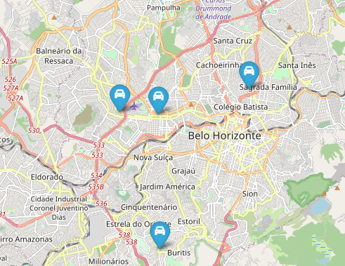

# Projeto de Localização de Empresas de Autopeças

Este projeto tem como objetivo localizar e exibir empresas que trabalham com autopeças em Belo Horizonte usando dados da Overpass API do OpenStreetMap. A aplicação utiliza Python para processamento de dados e geração de um mapa interativo com a biblioteca Folium.

## Tecnologias Utilizadas

- **Python**: Linguagem principal para o processamento e análise de dados.
- **Pandas**: Biblioteca para manipulação e análise de dados.
- **Folium**: Biblioteca para criação de mapas interativos.
- **Overpass API**: API para consulta de dados geoespaciais do OpenStreetMap.
- **Geopy**: Biblioteca para geocodificação e conversão de endereços em coordenadas geográficas.
- **Leaflet**: Biblioteca JavaScript para mapas interativos, utilizada pelo Folium.

## Estrutura do Projeto

1. **main.py**: Script principal que busca dados na Overpass API, processa as informações e gera o mapa interativo.
2. **requirements.txt**: Arquivo de dependências do projeto.
3. **venv/**: Ambiente virtual para gerenciamento das bibliotecas do Python.
4. **empresas_autopecas_BeloHorizonte.html**: Arquivo HTML gerado contendo o mapa interativo com as empresas de autopeças.

## Requisitos

- Python 3.8 ou superior
- Bibliotecas Python: pandas, folium, requests, geopy

## Imagem do mapa 
